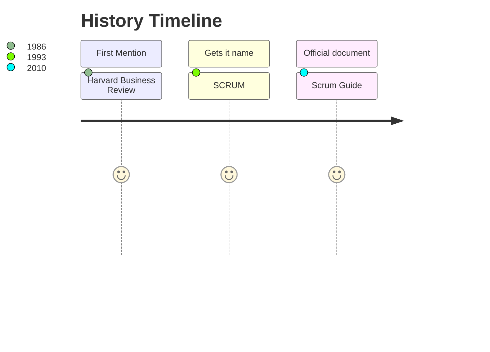
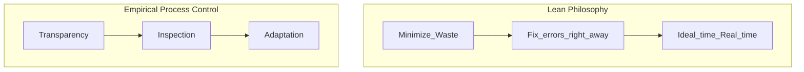
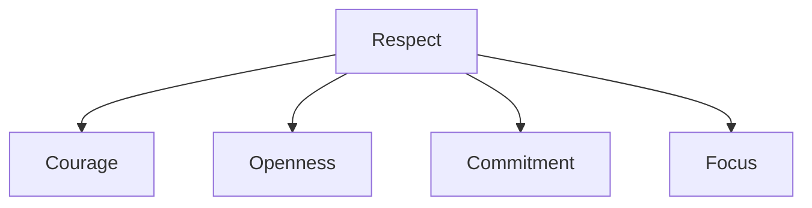

<h1 align="center"> Scrum🌀</h1>

>## What is it? 🤔
### Scrum is a framework that helps people, teams, and organizations to generate value through adaptive solutions to complex problems.💬 
### This framework is commonly used in technology teams, so knowing more about it gives you advantages when it comes to adapting to these professional environments.🖥️
---
<h2 align="center"> Essentials / Scrum Network Certification 📜</h2>

>## Introduction 💾
### Scrum is the perfect framework for complex products and joins the three basic concepts of a sucess project: 
### `1. What to do? ➡️ 2. How to do it? ➡️ 3. Do it on time`


### Scrum bases are:

---

>## Concepts 🔧
### Values of The Agile Manifesto
1. Individuals and Interactions Over Processes and Tools
2. Working Software Over Comprehensive Documentation
3. Customer Collaboration Over Contract Negotiation
4. Responding to Change Over Following a Plan

### Team
`Must not be more than 10 people` ❌

`Everyone have their own accountability` ✅

`There's no hierarchy` 🆙

```python
class Team:
    def __init__(Role1): 🎯
        role1.name = "Product Owner" 
        role1.task = "What to build?"
        role1.supports = "Understanding client's needs"
    def __init__(Role2): ⏰
        role2.name = "Scrum Master" 
        role2.task = "Delivers on time"
        role2.supports = "Continuous improvement"
    def __init__(Role3): 🏭
        role3.name = "Developer" 
        role3.task = "How to build it?"
        role3.supports = "Team multi-functional and auto-managed"
```
### Events
- Sprint 4 weeks or less 📆
- Meetings ➡️ Inspection ➡️ Adapt and Define
- Daily short meetings monitoring progress 📌

### Values

### Artifacts
### Product Backlog 📄
`What we want to build?`
> The product backlog is an ordered list of everything that is known to be needed in a product based on the product goal. It is constantly evolving and is never complete.

### Sprint Backlog 📋
`How we gonna build it?`
> The sprint backlog is a list of everything that the team commits to achieve in a given sprint. Once created, no one can add to the sprint backlog except the development team. 

### Potentially Releasable Product Increment 📱
`Definitions of done!`
> At the end of every sprint, the team delivers a product increment that is potentially releasable, meaning that it meets their agreed-upon definition of done. 
---

>## Implementation 📊
<h3 align="center"> 3-5-3 </h3>
<h3 align="center"> 3 Roles ➡️ 5 Events ➡️ 3 Artifacts </h3>


---

>## Conclusions 📂
> Scrum is a fine-detailed approach that has specific roles and ceremonies for each step of the process. The benefits of this type of approach include:
>> Increased transparency and project visibility 🔍
>> 
>> Accountability across teams 👥
>> 
>> Additional room for changes 🎯
>> 
>> Savings in cost 💰

> Scrum is best used in a project that is meant to be easy and flexible, but also is defined enough to achieve goals and hit targets that the customer or stakeholder designates
>> Is defined by sprints, so it is best leveraged in a project that benefits from the constant re-evaluation of goals, tasks, and roles of the team. 💬
>> 
>> Has a set of prescribed roles that allow structure to the project, yet has room for a shifting of assignments based on the timelines that evolve out of the process. ⌚
---


