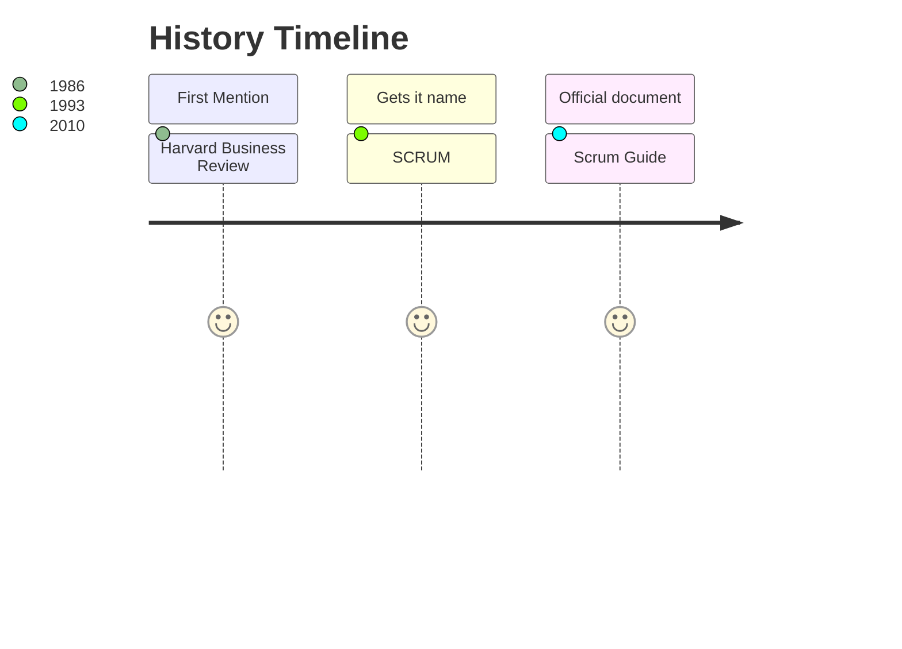
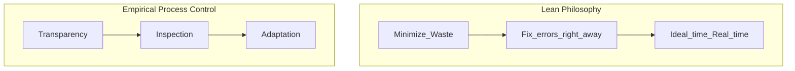

<h1 align="center"> Scrum🌀</h1>

>## What is it? 🤔
### Scrum is a framework that helps people, teams, and organizations to generate value through adaptive solutions to complex problems.💬 
### This framework is commonly used in technology teams, so knowing more about it gives you advantages when it comes to adapting to these professional environments.🖥️
---
<h2 align="center"> Essentials / Scrum Network Certification 📜</h2>

>## Introduction 💾
### Scrum is the perfect framework for complex products and joins the three basic concepts of a sucess project: 
### `1. What to do? ➡️ 2. How to do it? ➡️ 3. Do it on time`

### Scrum bases are:

---

>## Concepts 🔧
#### Scrum
---

>## Implementation 📊
#### Scrum
---

>## Conclusions 📂
#### Scrum
---

>## Certificate 🎓

